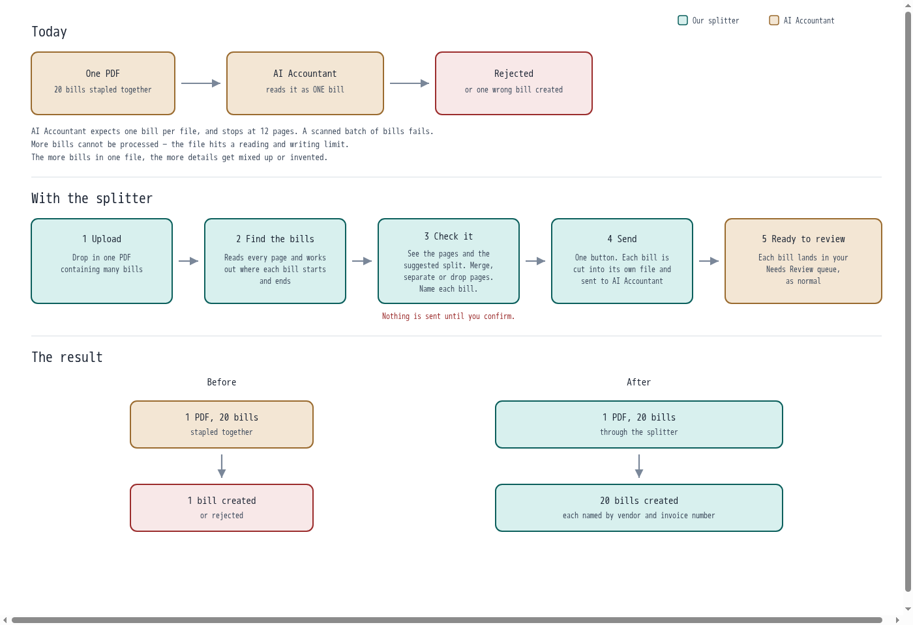

# Multi Page PDF Extraction



Folder: `multi-page-pdf-extraction/` (kebab-case for tooling).

Split a combined bill PDF into separate files. Review suggested page breaks,
make corrections, and download one PDF per bill in a ZIP.

```
PDF upload
  → OCR + boundary suggestions (OpenRouter, Gemma 4)
  → review page breaks / exclusions
  → physical split (one PDF per bill)
  → download all split PDFs in one ZIP
```

The free tool completes when the ZIP download starts. Optional extraction and
AI Accountant integration remain available for development workflows.

## Local development

This is for a laptop loop. It does **not** talk to the Render demo. Do not
run these commands against production.

**Port:** local `make dev` binds **127.0.0.1:7791** so it cannot collide with
anything already on `:7790`. Override with `LOCAL_PORT`.

### Fresh machine

```bash
cd multi-page-pdf-extraction
python3 -m venv .venv
.venv/bin/pip install -e .
cp .env.example .env          # then put OPENROUTER_API_KEY in .env
cd web && npm install && npm run build && cd ..
```

Or: `make setup` from this folder (same steps).

`.env` must exist. Live analyze needs `OPENROUTER_API_KEY`. AIA push stays **off**
until **both** `AIA_API_BASE` and `AIA_ALLOW_WRITES=true` are set. Leave them
unset locally.

### One command to bring the app up

```bash
cd multi-page-pdf-extraction
make dev
# open http://127.0.0.1:7791
```

That creates `.venv` if missing, installs the package, builds `web/dist` if
needed, and serves on 7791. If 7791 is busy it exits instead of stealing
another process.

Equivalent: `./scripts/dev.sh` or
`.venv/bin/pdfsplit serve --host 127.0.0.1 --port 7791`

### End-to-end test (on demand)

```bash
make e2e                 # fixtures — no Mistral spend
make e2e-live            # real Mistral (needs MISTRAL_API_KEY)
# or: .venv/bin/pdfsplit e2e
#     .venv/bin/pdfsplit e2e --live
```

The fixture run uploads a packet, analyzes, returns segments, confirms
boundaries, cuts PDFs, and checks page counts plus integrity. It includes the
redacted GGPL-style 3-page annexure packet
(`vendors/mistral/fixtures/pkt_ggpl_continuation_annexure.json`).

## Setup

Local runs need a gitignored `.env`. The standalone repo’s `.env` does not
carry over when this folder lives in the monorepo — create one here:

```bash
cd multi-page-pdf-extraction
cp .env.example .env
```

Edit `.env` and set at least:

| Variable | Required | Notes |
| --- | --- | --- |
| `OPENROUTER_API_KEY` | for live splits | From [OpenRouter Settings](https://openrouter.ai/settings/keys) |
| `OPENROUTER_MODEL` | no | Defaults to `google/gemma-4-26b-a4b-it` |
| `OUTPUT_DIR` | no | Defaults under the project; use a writable path |
| `DEMO_TOKEN` | on shared deploys | Share-link gate (`?k=…`); unset = open locally |
| `MAX_UPLOAD_PAGES` | no | Default `100` |

Live Mode A push also needs `AIA_API_BASE`, `AIA_ALLOW_WRITES=true`, and
cookies via `AIA_SESSION_COOKIES` (JSON) or `.secrets/aia_session_cookies.json`.
Never commit `.env` or cookie values.

## Quick start

From this folder (`multi-page-pdf-extraction/`):

```bash
python3 -m venv .venv && .venv/bin/pip install -e .
# Setup .env first (see Setup above)
.venv/bin/pdfsplit build-corpus
cd web && npm install && npm run build && cd ..
.venv/bin/pdfsplit serve      # http://localhost:7790
.venv/bin/python -m pytest -q
```

Shared deploys use a link token (`DEMO_TOKEN`): open `/?k=<token>` once to set
a cookie; unknown visitors get HTTP 404 (not a login page). `GET /healthz`
and `GET /robots.txt` stay public. Uploads are capped by `MAX_UPLOAD_PAGES`.

## Journey

1. **Upload** a packet PDF.
2. **Analyze** — OCR + suggested document cuts.
3. **Confirm** boundaries; exclude cover / junk pages.
4. **Push** each confirmed invoice to AIA (Mode A upload handshake).
5. Review and Approve happen **in AIA**, not here.

**Boundary trade (accepted):** the model is told a "document" is one bill's
worth of paper (annexures and signature pages stay with the bill). That can
glue same-supplier non-invoice pages (e.g. terms + delivery note in
`pkt_b05`) into one cut — those pages are excluded before push, so the cost
is an extra click, not a wrong voucher. Same-supplier invoices with
different bill numbers, and duplicate-number different-vendor pairs, must
still stay separate. See `docs/BOUNDARY_DESIGN.md` (includes a rejected
per-boundary yes/no experiment — do not reintroduce it casually).

Push is concurrent by default (`AIA_PUSH_CONCURRENCY=4`). Live HTTP requires
**both** `AIA_API_BASE` and `AIA_ALLOW_WRITES=true`. Credentials load from
`AIA_SESSION_COOKIES` or `.secrets/` (gitignored). Default transport is
fixture replay. Never `POST …/tally/bill` (no Approve path).

## Deploy (Render)

One Docker web service serves FastAPI + the built React app from `web/dist`.
Blueprint: repo-root `render.yaml` (`rootDir: multi-page-pdf-extraction`).

Share with stakeholders via `https://…/?k=<DEMO_TOKEN>` (sets a long-lived
cookie, then redirects to a clean URL).

**Ephemeral filesystem:** there is no persistent disk. Upload sessions live
under `OUTPUT_DIR` for the life of the container instance — they survive
between requests, and reset on redeploy or restart. That is fine for a demo.

**Plan / cold start:** `render.yaml` requests **Starter** (always-on).
Creating Starter needs a payment method on the Render workspace; until that
is on file the live service may run on **Free**, which spins down after ~15
minutes idle and can take ~30–60s to wake on the next shared-link hit.

## What is NOT built

- **Mode B** — create a bill without a PDF / `POST …/tally/bill` Approve.
- **Real-data validation** — corpus is synthetic (`ZZ TEST` vendors); no
  production ledger proof.

See `docs/AIA_AP_API.md` and `docs/AIA_STUCK_ROW.md` for the live upload
contract and stuck-row recovery. Cost claim for OCR+Small vs Medium:
`docs/COST_EVIDENCE.md`.

## Stack

- Python 3.13, FastAPI, pikepdf / pypdf, Mistral OCR + chat
- React review UI under `web/`
- Synthetic corpus `pkt_b01`…`pkt_b09` via `pdfsplit build-corpus`
